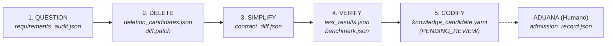

# Algorithmic Code Hardening Loop (`hardening-loop`)

[](https://www.python.org/downloads/)
[](https://github.com/felipe_gonzalez/hardening-loop)
[](https://mypy.readthedocs.io/)
[](https://docs.astral.sh/ruff/)
[](schemas/)
[](AGENTS.md)

**Algorithmic Code Hardening Loop** es un framework determinista y ejecutable diseñado para auditar, simplificar, verificar y codificar reglas de calidad sobre código generado por Inteligencia Artificial y agentes autónomos.

Implementa operativamente el ciclo de 5 pasos de **Musk / Zechner** integrado con el ciclo de vida **CLOOP** (*Clarify $\to$ Layout $\to$ Operate $\to$ Observe $\to$ Reflect $\to$ Reconcile $\to$ Handoff*).

---

## 🏗️ Invariantes de Orden Cero & Filosofía

1. **Prohibición de Auto-Admisión (Leyes VIII y XII):** Ningún agente puede auto-aprobar o promover reglas al estado canónico. Todo aprendizaje exige revisión y firma humana explícita en la [Aduana de Conocimiento](file:///Users/felipe_gonzalez/Developer/hardening-loop/src/hardening_loop/admission.py).
2. **Principio Fail-Closed (Ley VIII):** Si un hash SHA-256 no coincide, un schema JSON falla o un test no pasa, el sistema **aborta inmediatamente** en modo seguro. Cero degradación silenciosa.
3. **Señales antes que Relato (Ley XI):** Toda mutación produce un [EvidenceEnvelope](file:///Users/felipe_gonzalez/Developer/hardening-loop/src/hardening_loop/models.py) inmutable indexado por hashes SHA-256 de entrada y salida. Las explicaciones en lenguaje natural sin evidencia verificable carecen de validez.
4. **Anti-Ferrari / Simplicidad (Ley III):** Arquitectura minimalista sin dependencias pesadas ni capas de abstracción ornamentales.

---

## 🔄 El Ciclo de 5 Fases



| Fase | Responsabilidad Primaria | Artefacto Generado | Criterio de Verificación |
| :--- | :--- | :--- | :--- |
| **`question`** | Cuestionar supuestos, clasificar requerimientos (`explicit`, `inferred`, `historical`, `security_constraint`). | `requirements_audit.json` | Auditoría de requerimientos completada sin supuestos huérfanos. |
| **`delete`** | Detectar y podar código muerto, wrappers superfluos y herramientas no whitelisteadas. | `deletion_candidates.json`<br/>`diff.patch`<br/>`rollback_reference.json` | Generación de snapshot y diff de reversión hermético. |
| **`simplify`** | Reducir complejidad ciclomática preservando contratos públicos e interfaces. | `contract_diff.json` | 0 violaciones de firmas o contratos públicos. |
| **`verify`** | Ejecutar suites de pruebas, tests de regresión y benchmarks de rendimiento. | `test_results.json`<br/>`benchmark.json`<br/>`runtime_evidence.json` | Status `PASS` en suite determinista (`pytest`). |
| **`codify`** | Extraer reglas formales candidatas vinculadas a `evidence_id`. | `knowledge_candidate.yaml`<br/>`admission_record.json` | Candidato estructurado en estado `PENDING_REVIEW` para la Aduana. |

---

## 🚦 Máquina de Estados y Gobernanza (Knowledge Admission Gate)

```text
 [DRAFT] 
    │ (Cálculo de digest SHA-256 inicial)
    ▼
 [AUDITING] 
    │ (Ejecución de fases question, delete y simplify)
    ▼
 [PATCH_PROPOSED] 
    │ (Suite de verificación y tests TDD en VerifyPhase)
    ▼
 [VERIFIED] 
    │ (Generación de KnowledgeCandidate en CodifyPhase)
    ▼
 [KNOWLEDGE_CANDIDATE] (Estado: PENDING_REVIEW)
    │
    ├──────────────────────────────────────────┐
    ▼ (Aprobación explícita del Humano)       ▼ (Rechazo fundamentado)
 [ADMITTED]                                [REJECTED / OBSOLETE]
    │
    │ (Formalización en test determinista o regla en CI)
    ▼
 [CANONICAL]
    │
    ▼ (Superado por nuevo aprendizaje)
 [DEPRECATED]
```

---

## 🚀 Quickstart & Instalación

### Requisitos
- **Python:** $\ge 3.10$ (probado en Python 3.10 – 3.14)
- **Gestor:** `uv` o `pip` estándar

### Instalación en un paso

```bash
# Clonar repositorio
git clone https://github.com/felipe_gonzalez/hardening-loop.git
cd hardening-loop

# Crear entorno virtual e instalar dependencias de desarrollo
make install
```

---

## 💻 Uso del CLI

### 1. Ejecutar el Ciclo Completo sobre un Target

```bash
# Ejecutar todas las 5 fases sobre un archivo o directorio
hardening-loop run --target fixtures/qwen-tool-loop.py --phase all --output evidence/run-001
```

Salida esperada:
```text
=== Algorithmic Code Hardening Loop v0.3 ===
Target: /path/to/target.py
Output: /path/to/evidence/run-001
Initial State: DRAFT
[QUESTION] Status: PASS | Output Hash: f419be2d36a1... | ID: evi-f419be2d36a1
[DELETE] Status: PASS | Output Hash: ac3c99f15c78... | ID: evi-ac3c99f15c78
[SIMPLIFY] Status: PASS | Output Hash: fbeaef974e9b... | ID: evi-fbeaef974e9b
[VERIFY] Status: PASS | Output Hash: b3e5f70966b6... | ID: evi-b3e5f70966b6
[CODIFY] Status: PASS | Output Hash: 70e8461bfa93... | ID: evi-70e8461bfa93
Final State: KNOWLEDGE_CANDIDATE
Evidence artifacts successfully generated in evidence/run-001
```

### 2. Ejecutar Fases Individuales

```bash
# Solo cuestionamiento y auditoría de requerimientos
hardening-loop run --target src/ --phase question --output evidence/audit-01

# Solo verificación de contratos y tests
hardening-loop run --target src/ --phase verify --output evidence/audit-01
```

### 3. La Aduana de Conocimiento: Revisión y Admisión Humana

```bash
# Aprobar y admitir una regla candidata con firma de revisor
hardening-loop review evidence/run-001/knowledge_candidate.yaml --admit --reviewer "felipe-lead-architect" --notes "Validado contra política de seguridad"

# Rechazar una regla con fundamento
hardening-loop review evidence/run-001/knowledge_candidate.yaml --reject --reviewer "felipe-lead-architect" --notes "Falso positivo en entorno de pruebas"
```

---

## 🛠️ Comandos de Calidad y Verificación (`make`)

El repositorio cuenta con un pipeline determinista de un solo paso:

```bash
# Gate Unificado: Lint + Typecheck + Tests (MANDATORIO antes de cualquier commit)
make check

# Comandos individuales
make lint        # Ejecuta ruff check sobre src/ y tests/
make typecheck   # Ejecuta mypy en modo estricto
make format      # Formatea código y ordena imports con ruff
make test        # Ejecuta la suite completa de pytest
make clean       # Limpia caches, bytecode y artefactos temporales
make audit-qwen  # Ejecuta auditoría de prueba end-to-end sobre el fixture
```

---

## 📂 Estructura del Repositorio

```text
hardening-loop/
├── AGENTS.md                  # Constitución de Código Agéntico & Directrices (SSOT)
├── Makefile                   # Comandos deterministas de calidad y ejecución
├── pyproject.toml             # Configuración de paquete, ruff, mypy y pytest
├── pyrightconfig.json         # Configuración del servidor de tipos para el IDE
├── schemas/                   # JSON Schemas normativos (Draft-7)
│   ├── evidence_envelope.schema.json
│   ├── knowledge_candidate.schema.json
│   └── work_unit.schema.json
├── src/
│   └── hardening_loop/
│       ├── admission.py       # Knowledge Admission Gate (Aduana)
│       ├── cli.py             # CLI parser y comandos (run, review)
│       ├── models.py          # Dataclasses inmutables y digests criptográficos
│       ├── runner.py          # Orquestador del ciclo de 5 fases
│       ├── schema_validator.py# Validador JSON Schema Fail-Closed
│       ├── states.py          # Máquina de estados formal
│       └── phases/            # Implementación de las 5 fases
│           ├── base.py
│           ├── question.py
│           ├── delete.py
│           ├── simplify.py
│           ├── verify.py
│           └── codify.py
├── tests/                     # Suite de pruebas automatizadas (TDD)
│   ├── test_admission.py
│   ├── test_evidence.py
│   ├── test_invariants.py
│   ├── test_l1_implementation.py
│   ├── test_l2_contracts.py
│   ├── test_l3_epistemic.py
│   ├── test_phases.py
│   ├── test_qwen_loop_audit.py
│   ├── test_schema_validation.py
│   └── test_states.py
├── fixtures/                  # Targets de prueba (e.g. qwen-tool-loop.py)
└── docs/                      # Especificación formal y planes de trabajo
    └── spec_v0.1.md
```

---

## 📜 Gobernanza y Desarrollo Agéntico

Para consultar las leyes constitucionales completas, la metodología **Ask-to-Cole**, el protocolo de comunicación **Cold Re-Entry** y el desacoplamiento **Builder/Driver**, revisá:
- 📖 [AGENTS.md](file:///Users/felipe_gonzalez/Developer/hardening-loop/AGENTS.md) — Constitución Agéntica y Directrices Operativas.
- 📐 [docs/spec_v0.1.md](file:///Users/felipe_gonzalez/Developer/hardening-loop/docs/spec_v0.1.md) — Especificación Técnica Formal v0.1.

---

## 📄 Licencia

MIT © Felipe González
