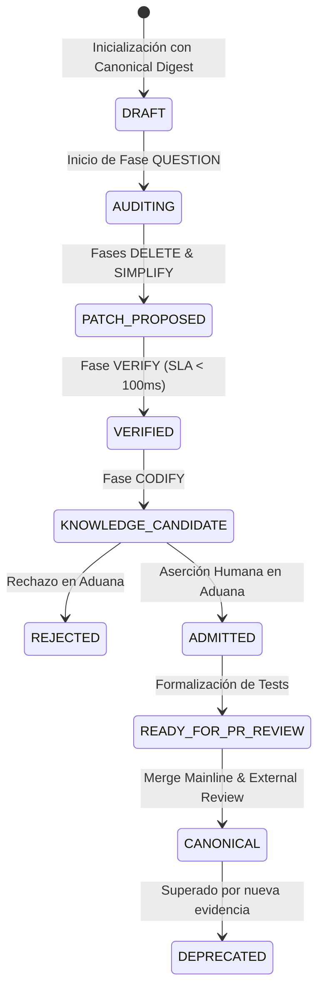
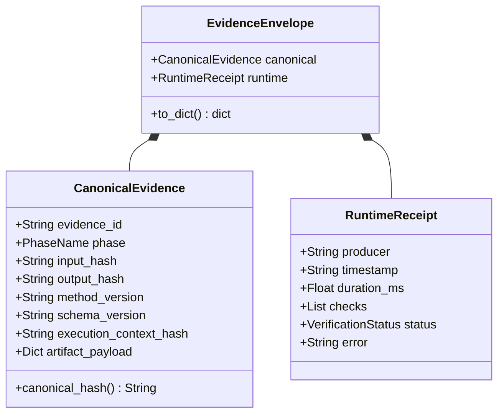

# Diagrama: Autómata de Estados y Flujo de Evidencia

## 1. Ciclo de Estados del WorkUnit

---

## 2. Estructura Ortogonal del Evidence Envelope

---

## Relaciones

- [[loop-5-fases|trata]] — 💊 Fases que disparan las transiciones.
- [[determinismo-canonico|usa]] — 🧠 Modelo formal del envelope.
